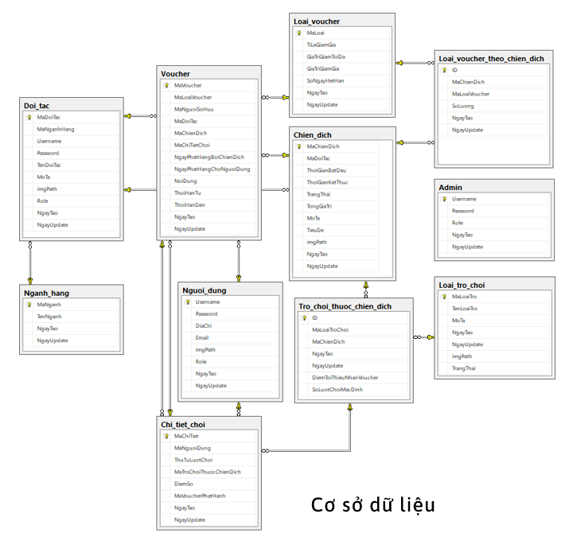
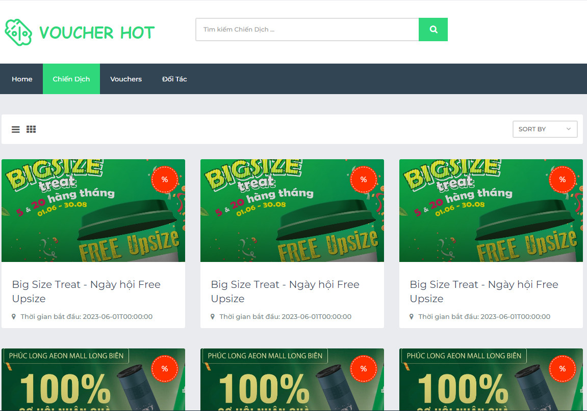

# Đồ án môn học - Quản lý Voucher


## Thành viên nhóm

| STT |    MSSV    | Họ và tên             |    Phân công          |
| :-: | :--------: | --------------------- | --------------------- |
|  1  | 20880263 | Nguyễn Hoàng Nam  |  Trang khách hàng  |
|  2  | 20850201 | Bùi Lê Quốc Bảo   |   Thiết kế API  |
|  3  | 21880092 | Hồ Phan Nhân   |   Trang quản trị & đối tác  |


## Yêu Cầu:

- Xây dựng Voucher website bao gồm 3 trang: quản trị, đối tác và khách hàng<br/>

## Database




## Hướng dẫn cài đặt

```
1. Chạy web thông qua lệnh: "npm start"
```
```
2. Truy cập: "http://localhost:5001/"
```
## Demo qua một phần của website:

https://www.youtube.com/watch?v=gOFhE8DfIxQ

[](https://www.youtube.com/watch?v=gOFhE8DfIxQ)
